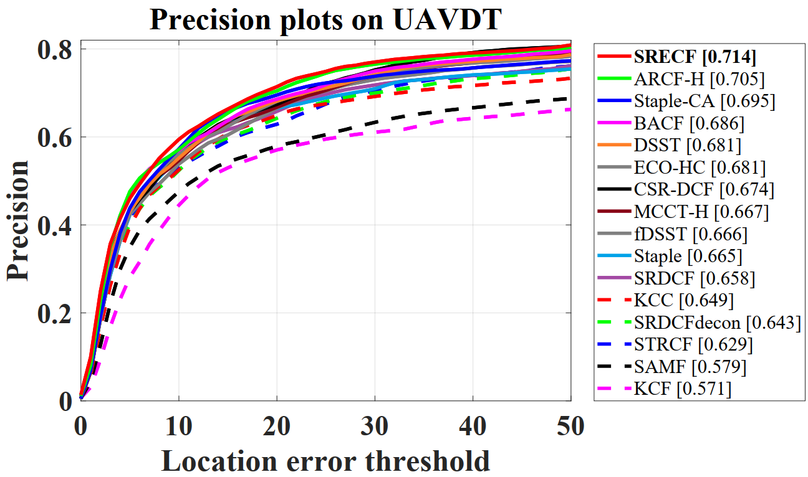
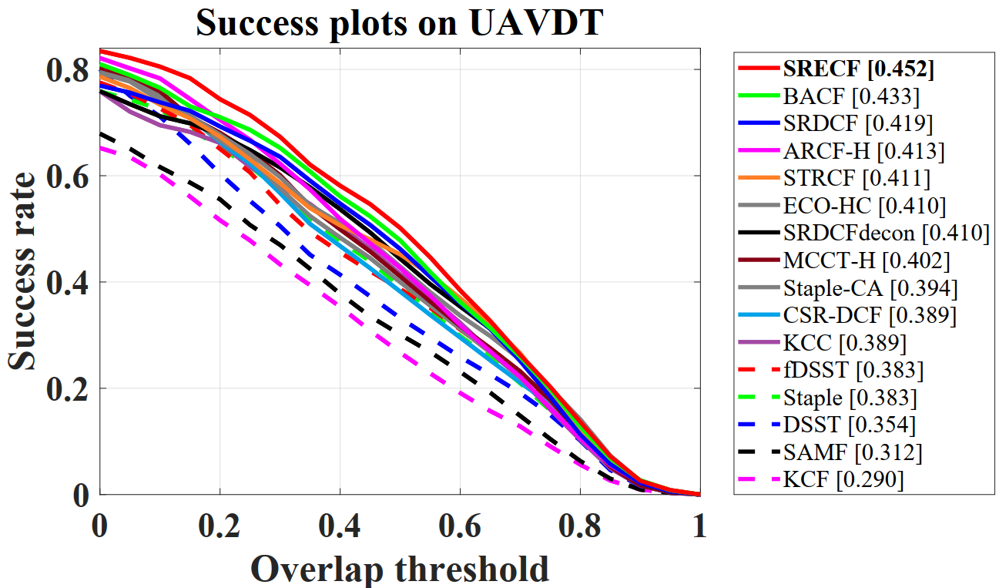
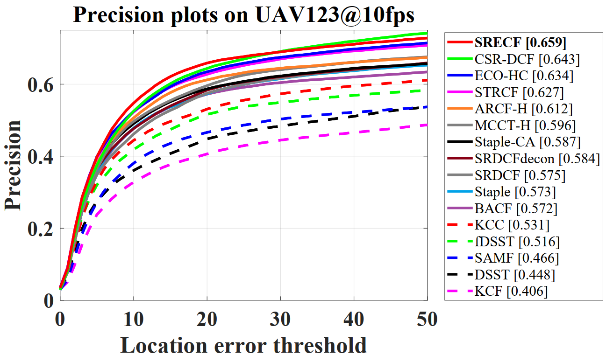
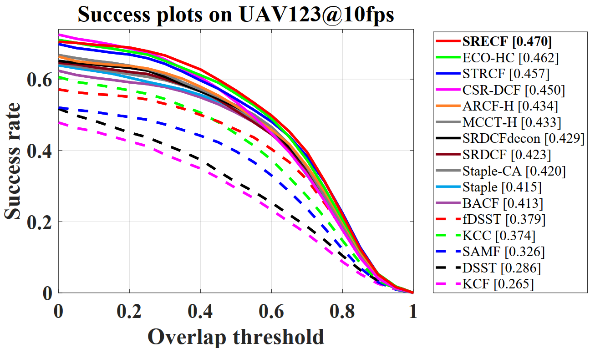
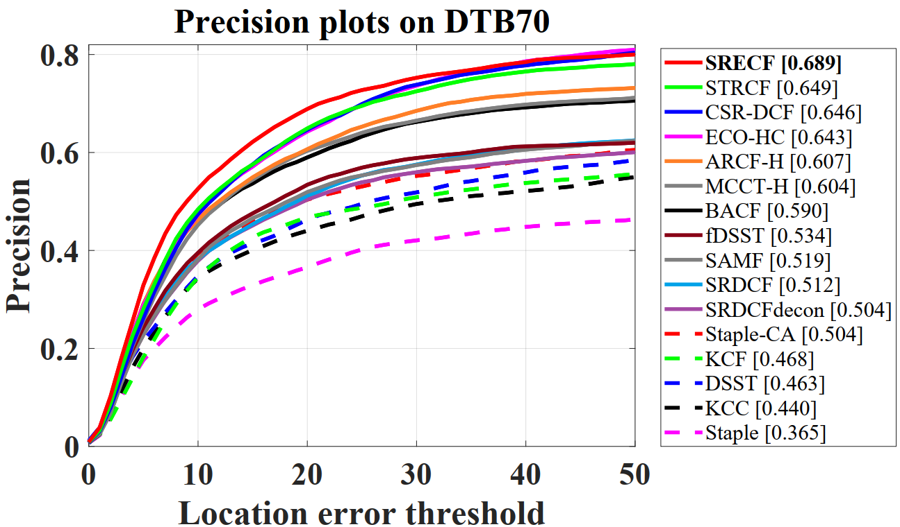
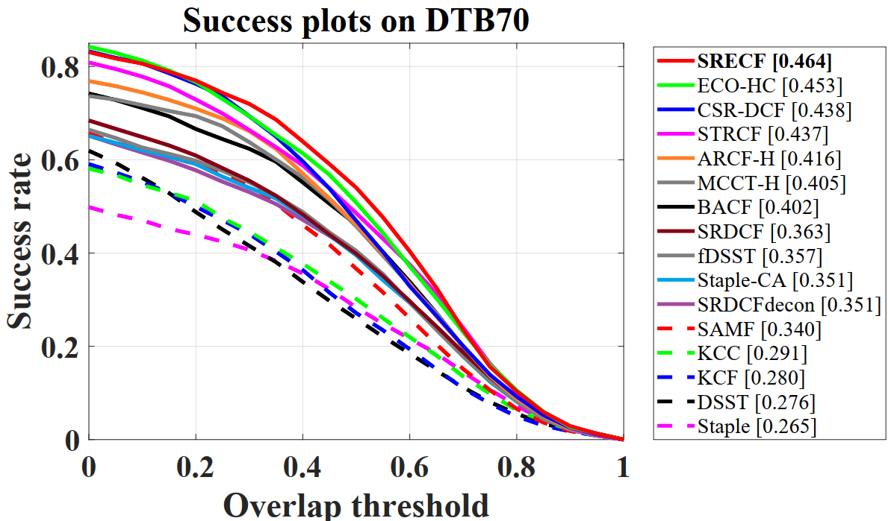

# Learning Spatial Reliability Enhanced Correlation Filters for Fast UAV Tracking  
Matlab implementation of our spatial reliability enhanced correlation filters (SRECF) tracker.

# Abstract

Recently, discriminative correlation filters (DCF) based tracker has achieved satisfactory performance with impressive efficiency, hence is a favorable choice in unmanned aerial vehicle (UAV) tracking applications. However, most research attempt to improve the discriminative ability of the entire filter and ignore the distinctiveness of different spatial locations. In this work, appearance variation information is fully exploited to generate a dynamic spatial reliability map which indicates pixel-level robustness. The locations with lower reliability are adaptively penalized and the ones with higher reliability are enhanced in the filter training, thereby forcing the filter to pay more attention to the robust location. Substantial experiments on three challenging UAV benchmarks demonstrate the superior accuracy and speed (>50fps) of our method against state-of-the-art works by an order of magnitude.

# Publication

SRECF is proposed in our paper for IROS 2020. Detailed explanation of our method can be found in the paper:

Changhong Fu, Jin Jin, Fangqiang Ding and Yiming Li.

Learning Spatial Reliability Enhanced Correlation Filters for Fast UAV Tracking  

# Contact

Changhong Fu

Email: [changhong.fu@tongji.edu.cn](mailto:changhong.fu@tongji.edu.cn)

### Jin Jin

Email: 

# Demonstration running instructions

This code is compatible with UAVDT, UAV123@10fps and DTB70 benchmark. Therefore, if you want to run it in benchmark, just put SRECF folder in trackers, and config sequences and trackers according to instructions from aforementioned benchmarks. 

# Results on UAV datasets

### UAVDT

### UAV123@10fps

### DTB70

### 

# Acknowledgements

We thank the contribution of Hamed Kiani Galoogahi, Ning Wang and Martin Danelljan for their previous work BACF,  MCCT-H and DSST.  The feature extraction modules and some of the parameter are borrowed from the MCCT tracker (https://github.com/594422814/MCCT). The scale estimation method is borrowed from the DSST tracker (http://www.cvl.isy.liu.se/en/research/objrec/visualtracking/scalvistrack/index.html).

